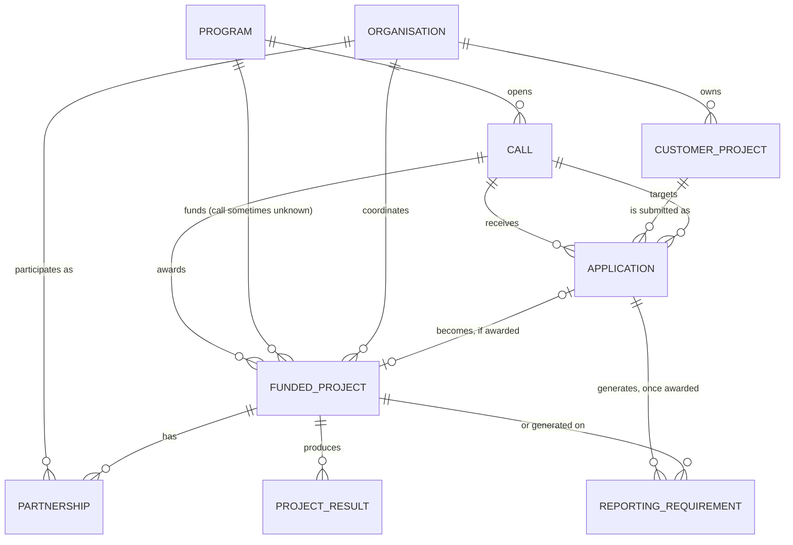

# EU Navigator — target data model

This document specifies the relational data model EU Navigator should move to
once it gets a real backend/database, replacing the current client-only,
`localStorage` + static-array prototype (see `lib/types.ts` and `lib/data/*`).
It is written to be handed directly to whoever builds that backend.

It is informed by the structure of the real external sources we plan to pull
from (see "External source mapping" at the end):

- **EU Funding & Tenders Portal** (REST API, Project & Results area) —
  Programme → Call → Topic → Grant/Project → Organisation
- **CORDIS** (REST/bulk CSV-XML-JSON/SPARQL) — Project → Organisation →
  Results (deliverables, publications, patents)
- **Keep.eu** (Interreg open data API) — Programme → Project → Partnership
  (Organisation + country + role)
- **Tillväxtverkets Projektbank** / **ESF-rådets Projektbank** (Swedish ERUF/ESF+
  open project registers)
- **Kohesio**, **CINEA** dashboards (LIFE/CEF/Innovation Fund/EMFAF), **EU
  Financial Transparency System**

The guiding idea: everything **we don't control** (programmes, calls, funded
projects elsewhere, results) is *reference data*, ideally synced from the
sources above. Everything **the customer controls** (their own project
pipeline, applications, reporting) is *tenant data*, scoped to one customer
organisation. The two meet at the matching/AI layer.

---

## 1. Entity overview

Two entities are **reference data** (shared, read-mostly, ideally synced from
external sources): `Program`, `Call`, `FundedProject`, `Organisation` (the
subset that are third-party award recipients), `ProjectResult`, `Partnership`.

Three entities are **tenant data** (per-customer, read/write, the actual
product): `Organisation` (the subset that are the customer's own org/depts),
`CustomerProject`, `Application`, `ReportingRequirement`.

`Organisation` is deliberately one table: a funded project's coordinator in
Keep.eu and a customer's own department in EU Navigator are the same shape of
thing (a legal entity or org unit with a NUTS region and a type), just
populated by different pipelines.

---

## 2. `Program`

Supersedes `FundingProgram` in `lib/types.ts`. One row per EU/national fund or
its 2014-2020 predecessor.

| Field | Type | Notes |
|---|---|---|
| `id` | `string` (PK) | Internal slug, e.g. `horizon-europe`. Stable even if `externalId` changes. |
| `name_sv`, `name_en` | `string` | Display name in both languages. |
| `shortName` | `string` | e.g. "Horisont Europa". |
| `description_sv`, `description_en` | `text` | |
| `legalBasis` | `string \| null` | e.g. "Regulation (EU) 2021/695" — from F&T Portal metadata. |
| `managingAuthority_sv`, `managingAuthority_en` | `string \| null` | e.g. "Tillväxtverket", "ESF-rådet", "European Commission — DG RTD". |
| `programmingPeriod` | `"2021-2027" \| "2014-2020"` | Replaces the current `status: active/legacy` boolean with the real EU period concept; `status` becomes derived (`period === current period`). |
| `sectors` | `Sector[]` | Existing taxonomy, kept. |
| `keywords` | `string[]` | Existing, kept for matching. |
| `geographicScope` | `"sweden" \| "eu-wide" \| "cross-border-region"` | Existing, kept. |
| `nutsScope` | `string[] \| null` | NUTS codes the programme is restricted to (populated for Interreg/regional funds via Keep.eu). |
| `typicalCoFinancingRate` | `number` | 0–1, existing. |
| `typicalDurationYears` | `[number, number]` | Existing. |
| `totalBudgetEUR` | `number \| null` | Whole-programme envelope, from F&T Portal/CORDIS programme metadata. |
| `sourceSystem` | `"manual" \| "funding-tenders-portal" \| "cordis" \| "keep-eu" \| "tillvaxtverket" \| "esf-radet"` | Which pipeline last wrote this row. |
| `externalId` | `string \| null` | The source system's own programme code (e.g. CORDIS `frameworkProgramme`). |
| `sourceUrl` | `string \| null` | Deep link to the programme on its source portal — internal/admin use only, never surfaced next to anonymised customer examples. |
| `lastSyncedAt` | `timestamp \| null` | `null` for hand-curated rows. |
| `createdAt`, `updatedAt` | `timestamp` | |

## 3. `Call` (Utlysning)

Supersedes `FundingCall`. One row per call/topic a customer can apply to.

| Field | Type | Notes |
|---|---|---|
| `id` | `string` (PK) | |
| `programId` | `FK -> Program.id` | |
| `title_sv`, `title_en` | `string` | |
| `topicId` | `string \| null` | F&T Portal's Topic identifier when the call is a Horizon Europe topic under a broader call. |
| `typeOfAction` | `string \| null` | e.g. `RIA`, `IA`, `CSA` (Horizon Europe), `null` for funds without this concept. |
| `status` | `"open" \| "upcoming" \| "closed"` | Adds `"closed"`, needed once we store real historical calls, not just the two current/planned states. |
| `openingDate`, `deadlineDate` | `date \| null` | **Replaces `deadlineMonthsFromNow`.** The current relative-offset field only works for a demo seeded "now" — a real store needs an absolute date; "months from now" becomes a UI-computed value. |
| `submissionProcedure` | `"single-stage" \| "two-stage" \| null` | |
| `budgetTotalSEK`, `minGrantSEK`, `maxGrantSEK` | `number` | Existing; keep SEK as the display currency but see §8 on currency handling. |
| `requiresPartnership` | `boolean` | Existing. |
| `eligibleApplicants_sv`, `eligibleApplicants_en` | `text` | Existing. |
| `priorities_sv`, `priorities_en` | `string[]` | Existing. |
| `extraKeywords` | `string[]` | Existing. |
| `evaluationCriteria` | `EvaluationCriterion[]` (own table `call_evaluation_criterion` if normalised) | Existing shape (`name_sv`, `name_en`, `maxPoints`). |
| `documents` | → own table `call_document` | Existing shape (`FundingDocument`): `id`, `type`, `title_sv/en`, `updatedAt`, `needsUpdate`. Kept as a child table, not embedded JSON, once there's a real DB — `needsUpdate` should become computed (source `updatedAt` vs. our last fetch) rather than hand-set. |
| `sourceSystem`, `externalId`, `sourceUrl`, `lastSyncedAt` | same shape as `Program` | |
| `createdAt`, `updatedAt` | `timestamp` | |

## 4. `Organisation`

New entity — does not exist explicitly today (organisation names are inline
strings on `ReferenceProject`/`ProjectBankEntry`).

| Field | Type | Notes |
|---|---|---|
| `id` | `string` (PK) | |
| `name` | `string` | Real name for reference-data rows synced from external sources; for the demo's own anonymised examples, the fictional name ("Exempelstad") — **never a real customer name mixed with real external orgs in the same field without a `kind` distinction (see below).** |
| `kind` | `"reference" \| "tenant"` | `reference` = a third party seen only in synced funded-project data (a coordinator, a partner org from CORDIS/Keep.eu); `tenant` = the customer or one of their internal departments/units, i.e. rows that back today's `ProjectBankEntry.department_sv/en` and `owner`. Keeping one table but tagging `kind` is what lets a customer later see "who else in my region got funded" without conflating their own org chart with reference orgs. |
| `tenantId` | `FK -> Tenant.id \| null` | Only set for `kind = "tenant"` rows, once EU Navigator is multi-tenant (see §9). |
| `country` | `string \| null` (ISO 3166-1 alpha-2) | |
| `nutsCode` | `string \| null` | NUTS2/3 region — used for Interreg eligibility checks and "similar projects nearby". |
| `type` | `"municipality" \| "region" \| "government-agency" \| "university" \| "research-institute" \| "ngo" \| "sme" \| "large-enterprise" \| "other"` | From F&T Portal/CORDIS organisation categorisation. |
| `pic` | `string \| null` | EU's Participant Identification Code, when known (F&T Portal/CORDIS). |
| `vatNumber` | `string \| null` | |
| `website` | `string \| null` | Never populated/surfaced for anonymised demo rows. |
| `sourceSystem`, `externalId`, `lastSyncedAt` | as above | |

## 5. `FundedProject` (Beviljat projekt)

New entity, **replaces both `ReferenceProject` and `AwardedProject`** — those
two existed separately only because the prototype built the "learn from
winners" library and the "post-award reporting" feature at different times;
structurally they're the same thing (a project that received EU funding) at
different lifecycle stages.

| Field | Type | Notes |
|---|---|---|
| `id` | `string` (PK) | |
| `externalId` | `string \| null` | Grant Agreement number / CORDIS project ID / Tillväxtverket diarienummer / Keep.eu project code — whatever the source system's own key is. |
| `programId` | `FK -> Program.id` | |
| `callId` | `FK -> Call.id \| null` | `null` when the source data doesn't expose which call/topic it was awarded under (true for a lot of older Tillväxtverket/ESF-rådet records) — **this nullability matters**: today's `ReferenceProject.programId`-only design already anticipated this, keep it. |
| `title` | `string` | |
| `acronym` | `string \| null` | CORDIS-style short name. |
| `theme_sv`, `theme_en` | `string` | Existing free-text theme classification, kept — useful until real topic taxonomies are fully mapped. |
| `description_sv` | `text` | Existing. Add `description_en` as a real field (today only `_sv` exists; `_en` is currently omitted in `ReferenceProject`, a gap to close since the rest of the app is bilingual). |
| `objective` | `text \| null` | CORDIS's own "objective" abstract field, kept verbatim where available (distinct from our own `description_sv`, which is our editorial summary). |
| `role` | `"coordinator" \| "partner"` | Renamed from today's `role: "owner" \| "partner"` to match CORDIS/Keep.eu vocabulary; this is the *customer's or anonymised example org's* role, i.e. shorthand for the `Partnership` row that matters most to the viewer. |
| `coordinatorOrgId` | `FK -> Organisation.id \| null` | |
| `period` | `"2021-2027" \| "2014-2020"` | Existing. |
| `startDate`, `endDate` | `date \| null` | Replaces the free-text `periodLabel`; keep `periodLabel` as a display-only derived string for legacy rows where only text was ever extracted. |
| `status` | `"signed" \| "ongoing" \| "closed" \| "terminated"` | New — needed once `FundedProject` also drives the reporting workflow, not just the reference library. |
| `totalBudgetSEK`, `euFundingSEK` | `number \| null` | Existing, kept nullable (disclosure is inconsistent across sources — `computeProgramStats`'s `disclosedBudgetCount` logic carries over unchanged). |
| `fundName` | `string` | Existing raw/un-normalised fund name string, kept for display fidelity where `Program` mapping is uncertain. |
| `indicators` | → own table `project_indicator` | Existing shape (`ReferenceProjectIndicator`): `label_sv/en`, `target`, `actual`, `unit_sv/en`. Only populated where a real final report exists (today: `digitalt-kompetenslyft`). |
| `sourceSystem`, `sourceUrl`, `lastSyncedAt` | as above | `sourceUrl` stored but **suppressed from rendering** for any row tagged as an anonymisation subject — see §7. |
| `createdAt`, `updatedAt` | `timestamp` | |

### 5a. `Partnership`

New child entity of `FundedProject`, modelled directly on Keep.eu's
Programme→Project→Partnership level, and needed the moment we ingest a real
multi-partner Interreg/Horizon project instead of only recording the one
organisation we care about via `FundedProject.role`.

| Field | Type | Notes |
|---|---|---|
| `id` | `string` (PK) | |
| `fundedProjectId` | `FK -> FundedProject.id` | |
| `organisationId` | `FK -> Organisation.id` | |
| `role` | `"lead-partner" \| "partner" \| "associated-partner"` | |
| `country` | `string` (ISO alpha-2) | Denormalised from `Organisation.country` for fast "how many countries" aggregate queries — acceptable, it's reference data. |
| `contributionEUR` | `number \| null` | Per-partner budget share, when disclosed. |

### 5b. `ProjectResult` (Deliverable/publication/patent)

New, CORDIS-shaped. Powers the future "vad brukar vinna?" / pattern-analysis
feature (you need concrete outputs, not just budget numbers, to say anything
about *what* wins).

| Field | Type | Notes |
|---|---|---|
| `id` | `string` (PK) | |
| `fundedProjectId` | `FK -> FundedProject.id` | |
| `type` | `"deliverable" \| "publication" \| "patent" \| "demonstrator" \| "other"` | |
| `title` | `string` | |
| `date` | `date \| null` | |
| `url` | `string \| null` | Suppressed for anonymisation subjects, same rule as `FundedProject.sourceUrl`. |

## 6. `CustomerProject`

Evolves `ProjectBankEntry` — same concept (the customer's own pipeline of
project ideas), extended to link into the new relational model instead of
carrying free-text department names.

| Field | Type | Notes |
|---|---|---|
| `id` | `string` (PK) | |
| `tenantId` | `FK -> Tenant.id` | New — see §9. |
| `title_sv`, `title_en` | `string` | Existing. |
| `ownerOrganisationId` | `FK -> Organisation.id` (`kind = "tenant"`) | **Replaces** `department_sv`/`department_en` free text — the department becomes a real `Organisation` row (a unit within the tenant), which is also what makes the "one example organisation's role config" settings in `orgProcess`/`useOrgConfig` attach to something concrete instead of a hardcoded string. |
| `owner` | `string` | Existing free-text contact person — kept as-is, not worth normalising into its own `Person` entity at this scale. |
| `status` | `ProjectStatus` (existing enum) | Unchanged. |
| `estimatedCostSEK` | `number` | Existing. |
| `periodStart`, `periodEnd` | `number` (year) | Existing. |
| `sector` | `Sector` | Existing. |
| `description_sv`, `description_en` | `text` | Existing. |
| `hasInternationalPartner` | `boolean` | Existing. |
| `candidateCallIds` | `string[]` (or child table `customer_project_candidate_call`) | New — persists what today is only a client-side computed `computeMatchesForEntry` result, so "why did we shortlist this call three weeks ago" survives a re-score after call data changes. |
| `aiReadinessPct`, `missingFields_sv`, `missingFields_en` | as existing | Kept as a *cached last computed value*; the source of truth becomes a live call to the readiness engine, this is just for list views/sorting without recomputation. |
| `createdAt`, `updatedAt` | `timestamp` | |

## 7. `Application` (Ansökan)

New entity. Today's prototype computes a `MatchResult` and lets the user draft
project-logic text in local component state (`ApplicationWorkspace`'s
`draftLogic`) that is thrown away on refresh — this is the biggest real gap
between "demo" and "product": nothing about an actual application in progress
is persisted anywhere. `Application` is that missing persistence layer.

| Field | Type | Notes |
|---|---|---|
| `id` | `string` (PK) | |
| `tenantId` | `FK -> Tenant.id` | |
| `customerProjectId` | `FK -> CustomerProject.id` | |
| `callId` | `FK -> Call.id` | |
| `status` | `"draft" \| "submitted" \| "under-review" \| "awarded" \| "rejected" \| "withdrawn"` | |
| `projectLogicRows` | → child table `application_logic_row` | Persists what `generateProjectLogic` proposes *and* what the user has edited — each row: `id`, `applicationId`, `field` (e.g. "mål", "aktiviteter", "resultat" — the existing `ProjectLogicRow` field key), `aiSuggestion_sv/en` (immutable, regenerable), `userDraft` (editable, nullable = "using AI suggestion as-is"), `updatedAt`. This is exactly the "reset to AI suggestion" UX already built client-side, just made durable. |
| `readinessScoreAtSubmission` | `number \| null` | Snapshot at the moment of submission, distinct from the live-recomputed score shown pre-submission. |
| `sectionCoachHistory` | → child table `application_coach_run` | Each `SectionCoachResult` run, timestamped, so a user can see their score trend across edits — this is the natural, non-gimmicky version of the "readiness history" feature that was deliberately deferred earlier for lack of persisted state; with `Application` as real storage it stops being gimmicky. |
| `reviewerNotes` | → child table `application_reviewer_note`, existing `ReviewerNote` shape | |
| `submittedAt` | `timestamp \| null` | |
| `resultingFundedProjectId` | `FK -> FundedProject.id \| null` | Set once `status` reaches `awarded` — this is the join back into the reference-data world; the customer's own success stories become future `FundedProject` rows other customers can learn from (with the customer's explicit consent — see §7a). |
| `createdAt`, `updatedAt` | `timestamp` | |

### 7a. Consent flag

Add `CustomerProject.shareAsReferenceOnAward: boolean` (default `false`).
Only when a customer opts in does an awarded `Application` get materialised
into a public/cross-tenant `FundedProject` + `ProjectResult` rows. This is the
concrete mechanism that keeps the anonymisation guarantee airtight going
forward: nothing about a specific tenant's real project ever becomes
reference data by default, only by explicit choice, and even then it's
governed by the same "who can see raw org identity vs. an anonymised label"
rule already implemented for the current seeded example organisation.

## 8. `ReportingRequirement`

Evolves `Commitment`/`AwardedProject.nextReportDueMonthsFromNow` into a proper
recurring-obligation entity, attachable to either a `FundedProject` (for
reference-data rows we track passively) or an `Application` post-award (for
the tenant's own live obligations) — hence two nullable FKs rather than one.

| Field | Type | Notes |
|---|---|---|
| `id` | `string` (PK) | |
| `fundedProjectId` | `FK -> FundedProject.id \| null` | |
| `applicationId` | `FK -> Application.id \| null` | Exactly one of the two FKs is set. |
| `type` | `"financial-report" \| "progress-report" \| "indicator-update" \| "final-report" \| "audit"` | |
| `dueDate` | `date` | Replaces `nextReportDueMonthsFromNow`'s relative offset for the same reason `Call.deadlineDate` replaces `deadlineMonthsFromNow`. |
| `status` | `"upcoming" \| "submitted" \| "overdue" \| "waived"` | |
| `indicators` | → child table `reporting_requirement_indicator`, existing `Commitment` shape (`indicator_sv/en`, `promisedValue`, `unit_sv/en`, `currentValue`, `comment_sv/en`) | |
| `submittedAt` | `timestamp \| null` | |

---

## 9. Cross-cutting notes

**Currency.** Everything user-facing today is SEK; everything from CORDIS/F&T
Portal is EUR. Store both where the source gives EUR (`totalBudgetEUR` on
`Program`, and consider adding `totalCostEUR`/`euContributionEUR` alongside
the SEK fields on `FundedProject` and `Call`) plus the `fxRate` and
`fxRateDate` used for any SEK value we computed ourselves, rather than baking
a silent conversion into a single field.

**Multi-tenancy.** The prototype has no login and one implicit "tenant"
(whoever has the browser tab open). The model above adds `tenantId` on
`Organisation` (tenant kind only), `CustomerProject`, and `Application` in
anticipation of real accounts; `Program`/`Call`/`FundedProject`/reference
`Organisation` rows stay tenant-free/shared. This can be introduced later
without reshaping the reference-data half of the schema at all.

**Sync jobs, not live API calls.** All `sourceSystem`/`externalId`/
`lastSyncedAt` fields assume a scheduled ETL job per source (F&T Portal REST
API, CORDIS bulk CSV, Keep.eu API, Tillväxtverket/ESF-rådet exports) writing
into `Program`/`Call`/`FundedProject`/`Organisation`/`Partnership`/
`ProjectResult`, not the app calling those APIs on each page load. Matching
and the "similar projects"/"vad brukar vinna?" features then run entirely
against our own database.

**"Similar projects" / semantic search.** Not modelled as its own table here
on purpose — this is an embedding index (e.g. `FundedProject.id` →
vector) built from `title` + `description_sv` + `objective` + `theme`, kept
in whatever vector store the backend chooses, and rebuilt on sync rather than
being part of the relational schema.

---

## 10. Migration map (current prototype → this model)

| Today (`lib/types.ts` / `lib/data/*`) | Becomes |
|---|---|
| `FundingProgram` | `Program` (+ `programmingPeriod`, `sourceSystem` fields) |
| `FundingCall`, embedded `FundingDocument[]` | `Call` (+ absolute dates), `call_document` child table |
| `ProjectBankEntry` | `CustomerProject` (department string → `Organisation` FK) |
| `ReferenceProject` | `FundedProject` (+ `description_en`, `status`) + `Partnership` rows for any co-applicants |
| `AwardedProject`, `Commitment` | Merged into `FundedProject` + `ReportingRequirement` |
| `OrgProcessPhase.roleExample` + `useOrgConfig` overrides | Unchanged in shape, but `roleExample.organisationName` becomes a lookup against the tenant's own `Organisation` row instead of a hardcoded string |
| Client-only `draftLogic` state in `ApplicationWorkspace` | `Application.projectLogicRows` (persisted) |
| `computeMatchesForEntry`/`computeBestMatchForEntry` (recomputed every render) | Same scoring logic, but `CustomerProject.candidateCallIds` + a `match_result` cache table store the last computed result for list views |

## 11. External source field mapping (for the sync jobs)

| Our field | Funding & Tenders Portal | CORDIS | Keep.eu | Tillväxtverket/ESF-rådet |
|---|---|---|---|---|
| `Program.externalId` | `frameworkProgramme` | `programmeId` | `programmeCode` | fund code |
| `Call.externalId` / `topicId` | `identifier` (Call), `topic` | — | `callId` | diarienummer |
| `FundedProject.externalId` | Grant Agreement number | `id` (project) | `projectId` | diarienummer |
| `Organisation.pic` | `organisation.pic` | `organization.legalName`+PIC | `partner.id` | — (rarely has a PIC) |
| `Partnership.role` | `role` (coordinator/participant) | `activityType` | `partner.role` | — |
| `ProjectResult` | Results & Deliverables area | `results`, `publications`, `patents` | — | — |

This table is the starting checklist for whoever writes the actual ETL
adapters — each column is effectively "what to read from that source's API/
export to fill this row."
